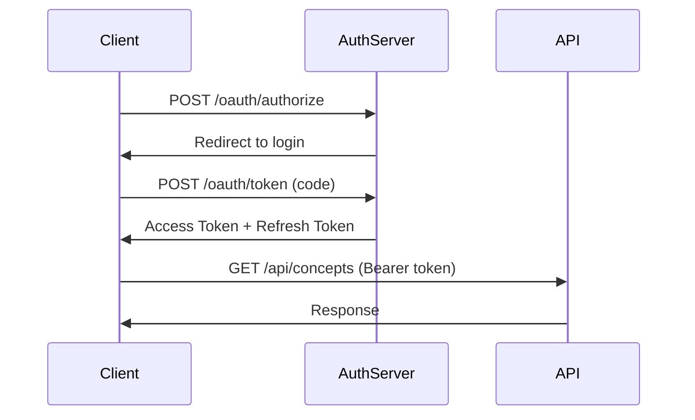

# API документация и руководство разработчика

## 1. REST API Reference

### 1.1 Аутентификация

#### POST /api/auth/register
Регистрация нового пользователя.

**Request:**
```http
POST /api/auth/register
Content-Type: application/json

{
  "email": "user@example.com",
  "username": "philosopher",
  "password": "SecurePass123!",
  "fullName": "John Doe"
}
```

**Response:**
```json
{
  "user": {
    "id": "550e8400-e29b-41d4-a716-446655440000",
    "email": "user@example.com",
    "username": "philosopher",
    "fullName": "John Doe",
    "createdAt": "2024-01-15T10:30:00Z"
  },
  "tokens": {
    "accessToken": "eyJhbGciOiJSUzI1NiIs...",
    "refreshToken": "eyJhbGciOiJSUzI1NiIs...",
    "tokenType": "Bearer",
    "expiresIn": 900
  }
}
```

**Error Responses:**
| Status | Code | Description |
|--------|------|-------------|
| 400 | VALIDATION_ERROR | Невалидные данные |
| 409 | USER_EXISTS | Пользователь уже существует |
| 429 | RATE_LIMIT_EXCEEDED | Превышен лимит запросов |

#### POST /api/auth/login
Вход в систему.

**Request:**
```http
POST /api/auth/login
Content-Type: application/json

{
  "email": "user@example.com",
  "password": "SecurePass123!",
  "twoFactorCode": "123456"  // Опционально, если включен 2FA
}
```

**Response:**
```json
{
  "user": {
    "id": "550e8400-e29b-41d4-a716-446655440000",
    "email": "user@example.com",
    "username": "philosopher",
    "roles": ["user", "premium"],
    "lastLoginAt": "2024-01-15T10:30:00Z"
  },
  "tokens": {
    "accessToken": "eyJhbGciOiJSUzI1NiIs...",
    "refreshToken": "eyJhbGciOiJSUzI1NiIs...",
    "tokenType": "Bearer",
    "expiresIn": 900
  },
  "requiresTwoFactor": false
}
```

#### POST /api/auth/refresh
Обновление токенов.

**Request:**
```http
POST /api/auth/refresh
Content-Type: application/json

{
  "refreshToken": "eyJhbGciOiJSUzI1NiIs..."
}
```

### 1.2 Концепции

#### GET /api/concepts
Получение списка концепций с фильтрацией и пагинацией.

**Request:**
```http
GET /api/concepts?page=1&limit=20&sort=-createdAt&filter[isPublic]=true&filter[tradition]=western&search=сознание
Authorization: Bearer {token}
```

**Query Parameters:**
| Parameter | Type | Description | Default |
|-----------|------|-------------|---------|
| page | number | Номер страницы | 1 |
| limit | number | Количество на странице | 20 |
| sort | string | Сортировка (+field или -field) | -createdAt |
| filter[field] | any | Фильтры по полям | - |
| search | string | Текстовый поиск | - |
| include | string | Включить связанные данные | - |

**Response:**
```json
{
  "data": [
    {
      "id": "550e8400-e29b-41d4-a716-446655440000",
      "name": "Диалектика сознания",
      "description": "Исследование противоречий...",
      "author": {
        "id": "user-123",
        "username": "philosopher"
      },
      "tradition": "western",
      "isPublic": true,
      "categoryCount": 5,
      "relationCount": 8,
      "qualityScore": 0.85,
      "createdAt": "2024-01-15T10:30:00Z",
      "updatedAt": "2024-01-15T15:45:00Z"
    }
  ],
  "meta": {
    "page": 1,
    "limit": 20,
    "total": 156,
    "totalPages": 8
  },
  "links": {
    "first": "/api/concepts?page=1&limit=20",
    "prev": null,
    "next": "/api/concepts?page=2&limit=20",
    "last": "/api/concepts?page=8&limit=20"
  }
}
```

#### GET /api/concepts/:id
Получение полной информации о концепции.

**Request:**
```http
GET /api/concepts/550e8400-e29b-41d4-a716-446655440000?include=categories,relations,theses
Authorization: Bearer {token}
```

**Response:**
```json
{
  "data": {
    "id": "550e8400-e29b-41d4-a716-446655440000",
    "name": "Диалектика сознания",
    "description": "Исследование противоречий...",
    "author": {
      "id": "user-123",
      "username": "philosopher",
      "avatarUrl": "https://..."
    },
    "tradition": "western",
    "isPublic": true,
    "qualityScore": 0.85,
    "categories": [
      {
        "id": "cat-123",
        "category": {
          "id": "category-1",
          "name": "Сознание",
          "canonicalName": "consciousness",
          "description": "...",
          "domain": "philosophy_of_mind"
        },
        "weight": 2.5,
        "position": {
          "x": 100,
          "y": 200
        }
      }
    ],
    "relations": [
      {
        "id": "rel-123",
        "from": "category-1",
        "to": "category-2",
        "type": {
          "id": "implies",
          "name": "IMPLIES",
          "isDirected": true
        },
        "weight": 3.0,
        "rationale": "Сознание предполагает..."
      }
    ],
    "theses": [
      {
        "id": "thesis-123",
        "text": "Сознание есть отражение...",
        "strength": "high",
        "relatedCategories": ["category-1", "category-2"],
        "orderPosition": 1
      }
    ],
    "metadata": {
      "viewsCount": 1523,
      "starsCount": 45,
      "forksCount": 12,
      "lastViewedAt": "2024-01-15T16:00:00Z"
    },
    "createdAt": "2024-01-15T10:30:00Z",
    "updatedAt": "2024-01-15T15:45:00Z"
  }
}
```

#### POST /api/concepts
Создание новой концепции.

**Request:**
```http
POST /api/concepts
Authorization: Bearer {token}
Content-Type: application/json

{
  "name": "Квантовое сознание",
  "description": "Исследование связи квантовой механики и сознания",
  "tradition": "contemporary",
  "isPublic": false,
  "categories": [
    {
      "categoryId": "consciousness",
      "weight": 3.0,
      "position": { "x": 100, "y": 100 }
    },
    {
      "categoryId": "quantum",
      "weight": 2.5,
      "position": { "x": 300, "y": 100 }
    }
  ],
  "relations": [
    {
      "fromCategoryId": "consciousness",
      "toCategoryId": "quantum",
      "relationTypeId": "correlates_with",
      "weight": 2.0,
      "rationale": "Квантовые эффекты в микротрубочках"
    }
  ]
}
```

**Response:**
```json
{
  "data": {
    "id": "new-concept-id",
    "name": "Квантовое сознание",
    // ... полная структура концепции
  },
  "meta": {
    "operationId": "op-123",
    "syncStatus": {
      "postgres": "completed",
      "neo4j": "pending",
      "elasticsearch": "pending"
    }
  }
}
```

#### PATCH /api/concepts/:id
Частичное обновление концепции.

**Request:**
```http
PATCH /api/concepts/550e8400-e29b-41d4-a716-446655440000
Authorization: Bearer {token}
Content-Type: application/json

{
  "name": "Диалектика сознания (обновлено)",
  "isPublic": true,
  "tags": ["диалектика", "сознание", "Гегель"]
}
```

#### DELETE /api/concepts/:id
Удаление концепции.

**Request:**
```http
DELETE /api/concepts/550e8400-e29b-41d4-a716-446655440000
Authorization: Bearer {token}
```

### 1.3 AI операции

#### POST /api/ai/generate-theses
Генерация тезисов для концепции.

**Request:**
```http
POST /api/ai/generate-theses
Authorization: Bearer {token}
Content-Type: application/json

{
  "conceptId": "550e8400-e29b-41d4-a716-446655440000",
  "options": {
    "count": 7,
    "style": "academic",
    "language": "ru",
    "focusCategories": ["consciousness", "dialectics"],
    "useWeights": true
  }
}
```

**Response:**
```json
{
  "operationId": "ai-op-123",
  "status": "queued",
  "estimatedTime": 15,
  "position": 3,
  "webhookUrl": "/api/ai/operations/ai-op-123/status"
}
```

#### GET /api/ai/operations/:id/status
Проверка статуса AI операции.

**Response:**
```json
{
  "operationId": "ai-op-123",
  "type": "thesis_generation",
  "status": "completed",
  "progress": 100,
  "result": {
    "theses": [
      {
        "text": "Сознание представляет собой...",
        "strength": "high",
        "relatedCategories": ["consciousness"],
        "quality": 0.92
      }
    ],
    "metadata": {
      "model": "claude-opus-4",
      "promptTokens": 1523,
      "completionTokens": 856,
      "processingTime": 12.5
    }
  }
}
```

#### POST /api/ai/synthesize
Синтез концепций.

**Request:**
```http
POST /api/ai/synthesize
Authorization: Bearer {token}
Content-Type: application/json

{
  "conceptIds": [
    "concept-1",
    "concept-2"
  ],
  "mode": "dialectical",
  "options": {
    "preserveStructure": true,
    "generateNewCategories": true,
    "targetComplexity": "moderate"
  }
}
```

### 1.4 Поиск

#### GET /api/search
Универсальный поиск.

**Request:**
```http
GET /api/search?q=диалектика&type=all&limit=20
Authorization: Bearer {token}
```

**Response:**
```json
{
  "results": [
    {
      "type": "concept",
      "id": "concept-123",
      "title": "Диалектика сознания",
      "snippet": "...диалектика как метод познания...",
      "score": 0.95,
      "highlights": {
        "title": ["<em>Диалектика</em> сознания"],
        "description": ["использует <em>диалектику</em> как"]
      }
    },
    {
      "type": "category",
      "id": "dialectics",
      "title": "Диалектика",
      "snippet": "Философский метод...",
      "score": 0.89
    },
    {
      "type": "thesis",
      "id": "thesis-456",
      "title": "Тезис о диалектическом развитии",
      "snippet": "...диалектическое противоречие...",
      "score": 0.76,
      "parentConcept": {
        "id": "concept-789",
        "name": "Законы диалектики"
      }
    }
  ],
  "facets": {
    "type": {
      "concept": 15,
      "category": 8,
      "thesis": 23
    },
    "tradition": {
      "western": 30,
      "eastern": 10,
      "contemporary": 6
    }
  },
  "suggestions": [
    "диалектический материализм",
    "диалектика Гегеля"
  ],
  "totalCount": 46,
  "searchTime": 0.125
}
```

## 2. GraphQL API

### 2.1 Schema Overview
```graphql
# Основные типы
type Concept {
  id: ID!
  name: String!
  description: String
  author: User!
  tradition: PhilosophicalTradition
  isPublic: Boolean!
  categories: [ConceptCategory!]!
  relations: [Relation!]!
  theses: [Thesis!]!
  qualityScore: Float
  metadata: ConceptMetadata
  createdAt: DateTime!
  updatedAt: DateTime!
}

type Query {
  # Получение концепции по ID
  concept(id: ID!): Concept
  
  # Поиск концепций
  concepts(
    filter: ConceptFilter
    sort: ConceptSort
    pagination: PaginationInput
  ): ConceptConnection!
  
  # Поиск
  search(
    query: String!
    type: SearchType
    limit: Int = 20
  ): SearchResults!
  
  # Текущий пользователь
  me: User
  
  # Аналитика
  conceptAnalytics(id: ID!): ConceptAnalytics!
}

type Mutation {
  # Создание концепции
  createConcept(input: CreateConceptInput!): ConceptPayload!
  
  # Обновление концепции
  updateConcept(
    id: ID!
    input: UpdateConceptInput!
  ): ConceptPayload!
  
  # Удаление концепции
  deleteConcept(id: ID!): DeletePayload!
  
  # AI операции
  generateTheses(
    conceptId: ID!
    options: GenerateThesesOptions
  ): AIOperationPayload!
  
  synthesizeConcepts(
    conceptIds: [ID!]!
    mode: SynthesisMode!
    options: SynthesisOptions
  ): AIOperationPayload!
}

type Subscription {
  # Обновления концепции в реальном времени
  conceptUpdated(conceptId: ID!): ConceptUpdate!
  
  # Прогресс AI операций
  aiOperationProgress(operationId: ID!): AIOperationProgress!
  
  # События коллаборации
  collaborationEvent(conceptId: ID!): CollaborationEvent!
}
```

### 2.2 Примеры запросов

#### Получение концепции с вложенными данными
```graphql
query GetConceptDetails($id: ID!) {
  concept(id: $id) {
    id
    name
    description
    author {
      id
      username
      avatarUrl
    }
    categories {
      category {
        id
        name
        description
        semanticSimilarCategories(limit: 3) {
          category {
            id
            name
          }
          similarity
        }
      }
      weight
      position {
        x
        y
      }
    }
    relations {
      id
      from {
        id
        name
      }
      to {
        id
        name
      }
      type {
        name
        semanticType
      }
      weight
      rationale
    }
    theses {
      id
      text
      strength
      relatedCategories {
        id
        name
      }
    }
    qualityScore
    metadata {
      viewsCount
      starsCount
      forksCount
    }
  }
}
```

#### Создание концепции
```graphql
mutation CreateConcept($input: CreateConceptInput!) {
  createConcept(input: $input) {
    success
    concept {
      id
      name
      # ... другие поля
    }
    errors {
      field
      message
    }
  }
}
```

Variables:
```json
{
  "input": {
    "name": "Новая концепция",
    "description": "Описание",
    "categories": [
      {
        "categoryId": "cat1",
        "weight": 2.0,
        "position": { "x": 100, "y": 100 }
      }
    ],
    "relations": [
      {
        "fromCategoryId": "cat1",
        "toCategoryId": "cat2",
        "typeId": "implies",
        "weight": 1.5
      }
    ]
  }
}
```

#### Подписка на обновления
```graphql
subscription ConceptUpdates($conceptId: ID!) {
  conceptUpdated(conceptId: $conceptId) {
    type
    timestamp
    userId
    changes {
      ... on CategoryAdded {
        category {
          id
          name
        }
        position {
          x
          y
        }
      }
      ... on RelationAdded {
        relation {
          from
          to
          type
        }
      }
      ... on ThesisGenerated {
        theses {
          id
          text
        }
      }
    }
  }
}
```

## 3. WebSocket API

### 3.1 Подключение
```javascript
const socket = io('wss://api.philosophy.example.com', {
  auth: {
    token: 'Bearer {accessToken}'
  },
  transports: ['websocket']
});

socket.on('connect', () => {
  console.log('Connected to WebSocket');
});

socket.on('error', (error) => {
  console.error('WebSocket error:', error);
});
```

### 3.2 События

#### join-concept
Присоединение к концепции для совместного редактирования.

```javascript
socket.emit('join-concept', {
  conceptId: 'concept-123'
});

// Ответ
socket.on('joined', (data) => {
  console.log('Active users:', data.activeUsers);
  console.log('Current locks:', data.locks);
});
```

#### graph-edit
Отправка изменений графа.

```javascript
socket.emit('graph-edit', {
  conceptId: 'concept-123',
  operation: 'ADD_CATEGORY',
  data: {
    categoryId: 'new-category',
    position: { x: 200, y: 300 },
    weight: 2.0
  }
});

// Получение обновлений от других пользователей
socket.on('graph-update', (update) => {
  console.log('Update from user:', update.userId);
  console.log('Operation:', update.operation);
  applyUpdate(update.data);
});
```

#### request-lock
Запрос блокировки элемента.

```javascript
socket.emit('request-lock', {
  conceptId: 'concept-123',
  elementId: 'category-456',
  elementType: 'category'
});

socket.on('lock-granted', (data) => {
  console.log('Lock granted for:', data.elementId);
});

socket.on('lock-denied', (data) => {
  console.log('Lock denied, held by:', data.lockedBy);
});
```

## 4. SDK и клиентские библиотеки

### 4.1 JavaScript/TypeScript SDK

#### Установка
```bash
npm install @philosophy/sdk
```

#### Использование
```typescript
import { PhilosophyClient, ConceptBuilder } from '@philosophy/sdk';

// Инициализация клиента
const client = new PhilosophyClient({
  apiUrl: 'https://api.philosophy.example.com',
  apiKey: 'your-api-key',
  // или
  accessToken: 'user-access-token'
});

// Создание концепции
const builder = new ConceptBuilder()
  .setName('Моя концепция')
  .setDescription('Описание')
  .addCategory('consciousness', { weight: 2.0, position: { x: 100, y: 100 } })
  .addCategory('time', { weight: 1.5, position: { x: 300, y: 100 } })
  .addRelation('consciousness', 'time', 'IMPLIES', { weight: 2.5 });

const concept = await client.concepts.create(builder.build());

// Поиск концепций
const results = await client.concepts.search({
  query: 'диалектика',
  filters: {
    tradition: 'western',
    isPublic: true
  },
  sort: '-qualityScore',
  limit: 20
});

// Генерация тезисов
const operation = await client.ai.generateTheses(concept.id, {
  count: 7,
  style: 'academic'
});

// Ожидание результата
const theses = await operation.waitForCompletion();

// Real-time подписки
const subscription = client.realtime.subscribeToUpdates(concept.id);

subscription.on('update', (update) => {
  console.log('Concept updated:', update);
});

// Отписка
subscription.unsubscribe();
```

### 4.2 Python SDK

#### Установка
```bash
pip install philosophy-sdk
```

#### Использование
```python
from philosophy_sdk import PhilosophyClient, ConceptBuilder
import asyncio

# Инициализация
client = PhilosophyClient(
    api_url="https://api.philosophy.example.com",
    api_key="your-api-key"
)

async def main():
    # Создание концепции
    builder = ConceptBuilder() \
        .set_name("Диалектический материализм") \
        .add_category("matter", weight=3.0, position=(100, 100)) \
        .add_category("consciousness", weight=2.0, position=(300, 100)) \
        .add_relation("matter", "consciousness", "DETERMINES")
    
    concept = await client.concepts.create(builder.build())
    
    # Поиск
    results = await client.search(
        query="материализм",
        search_type="all",
        limit=10
    )
    
    # AI операции
    operation = await client.ai.synthesize_concepts(
        concept_ids=["concept1", "concept2"],
        mode="dialectical"
    )
    
    # Ожидание результата с прогрессом
    async for progress in operation.track_progress():
        print(f"Progress: {progress.percentage}% - {progress.message}")
    
    result = await operation.get_result()

asyncio.run(main())
```

## 5. Webhooks

### 5.1 Настройка webhook
```http
POST /api/webhooks
Authorization: Bearer {token}
Content-Type: application/json

{
  "url": "https://your-service.com/webhook",
  "events": [
    "concept.created",
    "concept.updated",
    "thesis.generated",
    "synthesis.completed"
  ],
  "secret": "your-webhook-secret"
}
```

### 5.2 Формат событий
```json
{
  "id": "evt_123",
  "type": "concept.updated",
  "timestamp": "2024-01-15T10:30:00Z",
  "data": {
    "conceptId": "concept-123",
    "changes": {
      "name": {
        "old": "Старое название",
        "new": "Новое название"
      }
    }
  },
  "signature": "sha256=..."
}
```

### 5.3 Проверка подписи
```javascript
const crypto = require('crypto');

function verifyWebhookSignature(payload, signature, secret) {
  const hmac = crypto.createHmac('sha256', secret);
  hmac.update(JSON.stringify(payload));
  const expectedSignature = `sha256=${hmac.digest('hex')}`;
  
  return crypto.timingSafeEqual(
    Buffer.from(signature),
    Buffer.from(expectedSignature)
  );
}
```

## 6. Rate Limiting и квоты

### 6.1 Лимиты по endpoints

| Endpoint | Anonymous | Authenticated | Premium |
|----------|-----------|---------------|---------|
| GET /api/concepts | 20/min | 100/min | 500/min |
| POST /api/concepts | - | 10/hour | 100/hour |
| POST /api/ai/* | - | 10/hour | 100/hour |
| GET /api/search | 30/min | 200/min | 1000/min |

### 6.2 Заголовки Rate Limit
```http
X-RateLimit-Limit: 100
X-RateLimit-Remaining: 95
X-RateLimit-Reset: 2024-01-15T11:00:00Z
X-RateLimit-Resource: concepts
```

## 7. Обработка ошибок

### 7.1 Формат ошибок
```json
{
  "error": {
    "code": "VALIDATION_ERROR",
    "message": "Validation failed",
    "details": [
      {
        "field": "name",
        "message": "Name is required"
      },
      {
        "field": "categories",
        "message": "At least 2 categories required"
      }
    ],
    "requestId": "req_123",
    "timestamp": "2024-01-15T10:30:00Z"
  }
}
```

### 7.2 Коды ошибок

| Code | HTTP Status | Description |
|------|-------------|-------------|
| VALIDATION_ERROR | 400 | Невалидные входные данные |
| AUTHENTICATION_REQUIRED | 401 | Требуется аутентификация |
| FORBIDDEN | 403 | Нет прав доступа |
| NOT_FOUND | 404 | Ресурс не найден |
| CONFLICT | 409 | Конфликт (напр., дубликат) |
| RATE_LIMIT_EXCEEDED | 429 | Превышен лимит запросов |
| INTERNAL_ERROR | 500 | Внутренняя ошибка сервера |
| SERVICE_UNAVAILABLE | 503 | Сервис временно недоступен |

## 8. Версионирование API

### 8.1 Стратегия версионирования
- Версия указывается в URL: `/api/v1/`, `/api/v2/`
- Поддержка предыдущей версии минимум 6 месяцев
- Deprecated endpoints помечаются в заголовках

### 8.2 Deprecated заголовки
```http
X-API-Deprecation-Date: 2024-07-01
X-API-Deprecation-Info: https://docs.philosophy.example.com/deprecations
X-API-Sunset-Date: 2025-01-01
```

## 9. Примеры интеграций

### 9.1 GitHub Action для проверки концепций
```yaml
name: Validate Philosophy Concepts
on:
  push:
    paths:
      - 'concepts/*.yaml'

jobs:
  validate:
    runs-on: ubuntu-latest
    steps:
      - uses: actions/checkout@v3
      
      - name: Validate Concepts
        uses: philosophy/validate-action@v1
        with:
          api-key: ${{ secrets.PHILOSOPHY_API_KEY }}
          concepts-dir: ./concepts
          
      - name: Generate Report
        if: always()
        uses: philosophy/report-action@v1
        with:
          output: validation-report.md
```

### 9.2 Интеграция с Obsidian
```javascript
// Obsidian plugin
class PhilosophyPlugin extends Plugin {
  async onload() {
    this.addCommand({
      id: 'import-concept',
      name: 'Import Philosophy Concept',
      callback: async () => {
        const conceptId = await this.promptConceptId();
        const concept = await this.api.getConcept(conceptId);
        
        // Конвертация в Markdown
        const markdown = this.conceptToMarkdown(concept);
        
        // Создание файла
        await this.app.vault.create(
          `Philosophy/${concept.name}.md`,
          markdown
        );
      }
    });
  }
  
  conceptToMarkdown(concept) {
    return `# ${concept.name}

${concept.description}

## Категории
${concept.categories.map(c => `- **${c.category.name}** (вес: ${c.weight})`).join('\n')}

## Связи
${concept.relations.map(r => `- ${r.from.name} → ${r.to.name} (${r.type.name})`).join('\n')}

## Тезисы
${concept.theses.map((t, i) => `${i + 1}. ${t.text}`).join('\n')}

---
*Импортировано из Philosophy Service ${new Date().toISOString()}*
`;
  }
}
```

## 10. Безопасность API

### 10.1 OAuth 2.0 Flow


### 10.2 API Key best practices
- Используйте разные ключи для разных окружений
- Ротируйте ключи регулярно
- Ограничивайте scope ключей
- Мониторьте использование

### 10.3 CORS настройки
```javascript
// Разрешенные origins
const allowedOrigins = [
  'https://philosophy.example.com',
  'https://app.philosophy.example.com',
  /^https:\/\/.*\.philosophy\.example\.com$/
];

// Для development
if (process.env.NODE_ENV === 'development') {
  allowedOrigins.push('http://localhost:3000');
}
```